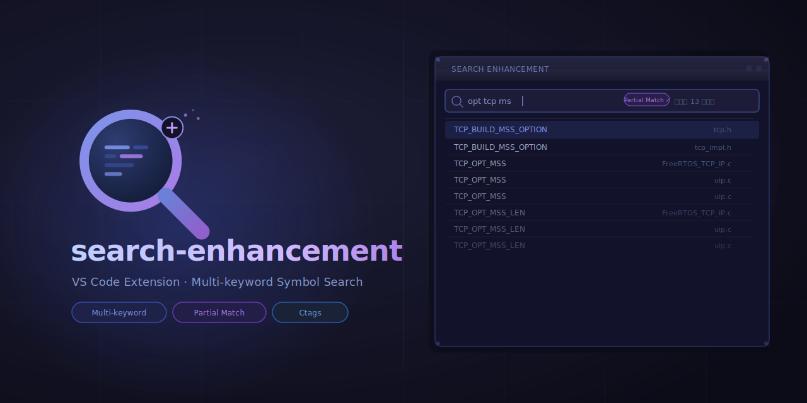

**English** | [繁體中文](README.zh-TW.md)



# search-enhancement

A VS Code extension that enhances built-in search with multi-keyword symbol matching backed by [Universal Ctags](https://github.com/universal-ctags/ctags).

## Features

Type space-separated keywords in the search box. Results are symbols whose name contains **all** keywords, regardless of the order you typed them. A *partial match* mode is also available — turn it on and any symbol whose name *partially* contains each keyword will surface.


## Installation

1. Install [Visual Studio Code](https://code.visualstudio.com/) v1.96 or newer
2. Search for `search-enhancement` in the Marketplace and install

## Requirements

The extension reads from a Ctags-generated symbol index. Set it up before first use:

1. Open a folder as a workspace
2. Install [Universal Ctags](https://github.com/universal-ctags/ctags). Pre-built binaries:
   - [Windows](https://github.com/universal-ctags/ctags-win32/tags)
   - [Linux](https://github.com/universal-ctags/ctags-nightly-build/tags)
   - [macOS](https://formulae.brew.sh/formula/universal-ctags)
3. From the workspace root, generate the index:
   ```sh
   ctags -R --languages=C,C++ --fields=+n --extras=+q -f .tags
   ```
   Adding the ctags directory to `PATH` makes this easier to re-run.

## Usage

1. Press `Ctrl` + `Shift` + `P` and run **Search Symbols by Keywords**, or focus the editor and press `Ctrl` + `Alt` + `F`. The search panel opens in the primary side bar (you can drag its icon to the secondary side bar).
2. Type space-separated keywords in the search box.
3. Click any result to open the file at the matching line.
4. Re-run ctags whenever your code changes — line numbers depend on the index being current.

## Tags File Configuration

- Primary setting: `searchEnhancement.tagsFilePaths` (string array). Supports multiple `.tags` files.
- When `tagsFilePaths` is empty:
  - If legacy `searchEnhancement.tagsFilePath` has a custom value, it is migrated into `tagsFilePaths[0]` and written to your settings.
  - Otherwise the extension runs with the default `${workspaceFolder}/.tags` in memory **without modifying any settings file**.
- Legacy `searchEnhancement.tagsFilePath` is deprecated and retained only for migration compatibility.

## Contributing

Contributions, bug reports and feature requests are welcome. See [Contributing.md](Contributing.md) for details.

## Developing

```sh
npm install
npm run compile
```

Press `F5` in VS Code to launch a development host with the extension loaded.

Tests:

```sh
npm test                  # unit + integration
npm run test:unit         # unit only — runs in plain Node, no VS Code needed
npm run test:integration  # e2e against a real VS Code instance
```

## License

This project is licensed under the [MIT](License) license.

## Acknowledgements

Icon adapted from [SVG Repo](https://www.svgrepo.com/).
