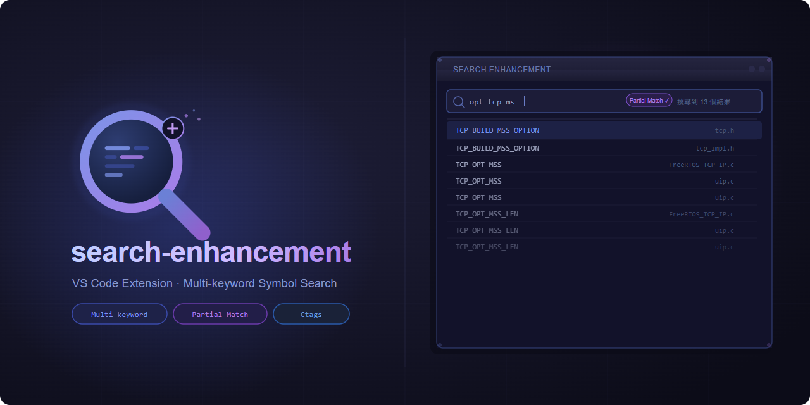

[English](README.md) | **繁體中文**



# search-enhancement

[](https://marketplace.visualstudio.com/items?itemName=jeffreyhc.vscode-search-enhancement)
[](https://marketplace.visualstudio.com/items?itemName=jeffreyhc.vscode-search-enhancement)
[](https://github.com/jeffreyhc/vscode-search-enhancement/actions/workflows/node.js.yml)
[](LICENSE)

在百萬行等級的 C/C++ codebase 裡，邊打字邊找到任何 function / variable / macro。多關鍵字搜尋，使用 [Universal Ctags](https://github.com/universal-ctags/ctags) 索引；專為 FreeRTOS、kernel、embedded 與 IntelliSense 跑不起來的 legacy 專案設計。

> ⚡ **v0.6.0**：1.65M symbols 的 `.tags` cold parse 實測從約 11.1 秒降至 3.0 秒，parser heap growth 約減少 57%。搜尋面板仍會在背景預熱，完成後搜尋約 62 毫秒。
>
> **v0.5.0**：百萬 symbols 索引上加速 30× — warm cache 3 秒 → 100 毫秒。詳見 [CHANGELOG](CHANGELOG.md)。

## Features

使用者可以在搜尋欄輸入要搜尋的關鍵字，關鍵字之間可以用空白隔開，搜尋結果會是包含全部關鍵字的symbol (不論關鍵字的先後順序)。並且提供partial match mode，只要提供的關鍵字部分符合就能找到相關symbol。


## 為什麼要用這個，而不是 `Ctrl+T`（Go to Symbol in Workspace）？

VS Code 內建的 symbol search 走當下作用中的 Language Server。對 C/C++ 來說等於 clangd 或 cpptools 需要完整的專案設定（`compile_commands.json`、IntelliSense database）。對許多真實專案 — FreeRTOS / Zephyr / Linux / 廠商 SDK / 老的 build system — 這些設定常常壞掉、慢、或根本沒有。

這個 extension 改用 [Universal Ctags](https://github.com/universal-ctags/ctags) 索引：

- **不需要 build system。** ctags parse 得了就搜得到。不需要 `compile_commands.json`、不需要 LSP daemon、不需要 IntelliSense database。
- **多關鍵字 AND 搜尋。** 打 `task create` 就能找到 `vTaskCreateStatic`、`xTaskCreatePinnedToCore` 等，順序無關。加底線像 `port_NVIC` 變成 phrase 比對。
- **為大型 codebase 設計。** 百萬 symbols 規模 warm cache ~100 毫秒；每打一個字都不會卡 UI。
- **輸入前先預熱。** 搜尋面板開啟時會在背景解析 `.tags`。若立刻搜尋，query 會共用進行中的 parse、避免重複工作，但仍需等待剩餘的預熱時間。
- **包含 macros、typedef、ctags 認得的一切。** 包含很多 LSP 抓不到的 symbol。

## Installation

1. 下載並安裝 [Visual Studio Code](https://code.visualstudio.com/) (需要v1.96(含)之後的版本)
2. 在VS Code中的延伸模組Marketplace搜尋search-enhancement以安裝

## Requirements
這個擴充套件使用前需要先做前置設定:
1. 對資料夾建立workspace
2. 使用[Ctags](https://github.com/universal-ctags/ctags)建立symbol list:
   1. 請根據使用平台選擇對應的release版本下載:
      1. [Windows](https://github.com/universal-ctags/ctags-win32/tags)
      2. [Linux](https://github.com/universal-ctags/ctags-nightly-build/tags)
      3. [Mac](https://formulae.brew.sh/formula/universal-ctags)
   2. 下載後在workspace根目錄執行`ctags -R --languages=C,C++ --fields=+n --extras=+q -f .tags` (建議可將ctag資料夾加入path環境變數方便呼叫)

## Usage

1. 按 `Ctrl` + `Shift` + `P` 叫出命令欄並輸入 `Search Symbols by Keywords` 或滑鼠先在主要編輯區點一下後按下`Ctrl` + `Alt` + `F`，兩個方法都可以叫出Search Enhancement功能，預設會先出現在主要側邊欄，建議可以把圖標拉往次要側邊欄喔
2. 在搜尋框輸入要搜尋的關鍵字，關鍵字之間可以用空白隔開
3. 搜尋結果會顯示在側邊欄中，點擊結果可以打開對應的文件並跳到對應行數
4. 由於跳轉的位置取決於Ctags建立的symbol list，請記得定期更新symbol list以獲得最好的使用體驗

## Contributing

歡迎貢獻代碼、報告問題和提交功能請求。請參閱 [CONTRIBUTING.md](CONTRIBUTING.md) 了解更多資訊。

## Developing
- `npm install`
- `npm run compile`
- `F5` to start debugging

## License

此專案採用 [MIT](LICENSE) 授權條款。

## 致謝

圖標來源於 [SVG Repo](https://www.svgrepo.com/)

## 設定

所有設定都在 `searchEnhancement.*` 命名空間下。可在 Settings UI (`Ctrl` + `,`) 搜尋 *Search Enhancement*，或直接編輯 `settings.json`。

| 設定 | 型別 | 預設 | 說明 |
|---|---|---|---|
| `tagsFilePaths` | `string[]` | `[]`（fallback 到 `${workspaceFolder}/.tags`）| 一或多個 ctags 索引檔，可以填絕對路徑或 `${workspaceFolder}/...` 樣板。`resource` scope，multi-root workspace 的每個 folder 可獨立設定。 |
| `debounceTime` | `number` | `600` | 最後一個按鍵到觸發搜尋的等待毫秒數。值越低反應越快但更耗 CPU；越高越省但體感較慢。 |
| `defaultGroupBy` | `"name"` \| `"file"` | `"name"` | 搜尋面板開啟時的初始分組方式。可從面板右上角 More Actions (`...`) 選單即時切換，不需要 reload。 |
| `precomputeSegments` | `boolean` | `true` | 在 parse `.tags` 時就把每個 symbol 的 lowercase + underscore-split segments 算好快取起來，搜尋時不重算。對大型 index 大約 3–30× 加速，代價約每 100 萬 symbols 多 50–100 MB 常駐記憶體。 |
| `profileSearch` | `boolean` | `false` | 開啟後每次搜尋會把分階段耗時印到 **Search Enhancement** Output channel，用於診斷慢搜尋。一般使用建議關閉。 |
| `warmTagsCacheOnViewOpen` | `boolean` | `true` | 搜尋面板開啟時在背景 parse 設定的 `.tags`。若預熱完成前就搜尋，仍需等待剩餘的 parse；關閉後會回到 cold-first-search 的舊機制。 |

### Tags 檔路徑

- 當 `tagsFilePaths` 為空時：
  - 若 legacy `searchEnhancement.tagsFilePath`（已 deprecated）有自訂值，會把該值 migrate 進 `tagsFilePaths[0]` 並寫入 settings
  - 否則以記憶體中的預設值 `${workspaceFolder}/.tags` 運作，**不會修改任何 settings 檔**
- `searchEnhancement.tagsFilePath`（單數）僅供 migration 相容性保留，新設定請用 `tagsFilePaths`

### 記憶體 vs 速度的取捨（`precomputeSegments`）

預設 `true` 是針對一般開發機器跟大型 codebase 調校 — 1.65M symbols 的 index 上，warm cache 搜尋從 ~3s 降到 ~100ms。如果你 index 的是小型專案、或是記憶體吃緊的環境，可以設為 `false` 省下 per-symbol cache（每 100 萬 symbols 約 50–100 MB）。切換即時生效，下一次搜尋自動 clear 並重新 parse。

### 診斷慢搜尋（`profileSearch`）

開啟設定後，打開 `View` → `Output` 並從右側 channel 選單選 **Search Enhancement**。首次 cache miss 時會先印出 parser 各階段耗時與 heap snapshot：

```
[00:55:05] Parse .tags "D:\project\.tags"
  read file             737.8ms  (290.6 MiB)
  split lines           113.2ms  (1652591 lines)
  parse rows           1565.2ms  (1652526 symbols)
  precompute segments   545.0ms
  ---
  parse total          2961.2ms
  heap used snapshot              31.5 -> 777.9 MiB  (+746.5 MiB)
```

接著每次搜尋會印出像這樣的內容：

```
[14:32:05] Search "port" partial=false groupBy=name
  resolve paths            0.2ms
  tags cache              45.3ms  (1 files, 1 miss)
  dedupe                   0.0ms  (47288 symbols)
  filter                  18.7ms  (47288 → 137 matches)
  build results            0.4ms
  post message             0.1ms
  ---
  extension total         64.7ms
  webview render          12.5ms  (137 results)
  ---
  end-to-end total        77.2ms
```

要比較舊機制與背景預熱的成本，先開啟 `profileSearch`，把 `warmTagsCacheOnViewOpen` 設為 `false`，reload window 後搜尋一次。接著設為 `true`，再次 reload，等 `Tags warm-up` profile 區塊出現後搜尋同一組字串。兩組之間 reload 可避免前一組已解析的 cache 影響結果。

若背景預熱已關閉或尚未完成，第一次搜尋會付一次 `tags cache` 的 parse cost（與索引大小成正比）；之後的搜尋直接重用 parse 結果。
